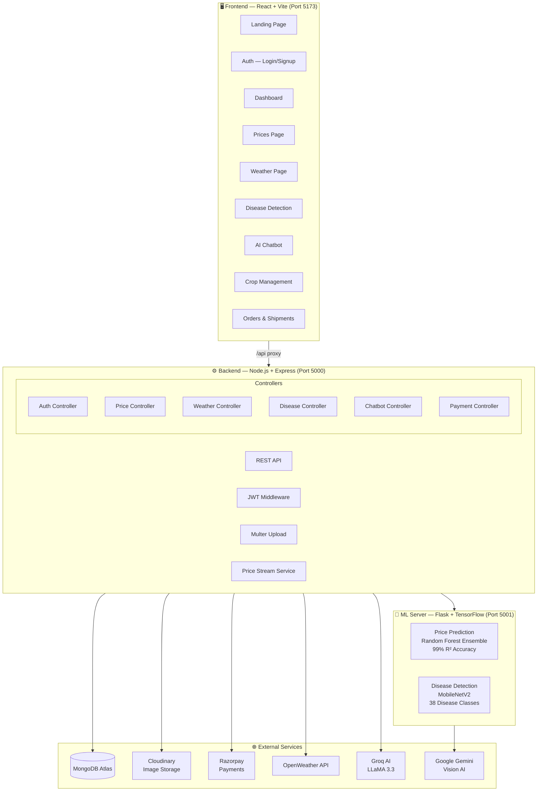

<!-- Header Section -->
<div align="center">


<br/>

<!-- Animated Divider -->

<br/>

<!-- Stats Badges -->
<p align="center">
  <a href="https://github.com/jackstealer/AgriSmart/stargazers"></a>
  <a href="https://github.com/jackstealer/AgriSmart/network"></a>
  <a href="https://github.com/jackstealer/AgriSmart/issues"></a>
  <a href="https://opensource.org/licenses/MIT"></a>
</p>

<!-- Quick Navigation -->
<p align="center">
  <a href="#-quick-start"><kbd>🚀 Quick Start</kbd></a>
  <a href="#-features"><kbd>✨ Features</kbd></a>
  <a href="#️-architecture"><kbd>🏗️ Architecture</kbd></a>
  <a href="#-tech-stack"><kbd>💻 Tech Stack</kbd></a>
  <a href="#-api-reference"><kbd>📡 API Docs</kbd></a>
  <a href="#-contributing"><kbd>🤝 Contributing</kbd></a>
</p>

</div>

<br/>

## 📖 About The Project

> **AgriSmart** is a next-generation, comprehensive full-stack agricultural management platform designed to empower farmers and streamline the agricultural supply chain. By leveraging cutting-edge Artificial Intelligence and Machine Learning, AgriSmart bridges the gap between farmers and buyers, providing actionable insights and robust tools for farm management.

### 🌟 Why AgriSmart?
In the modern era, traditional farming faces numerous challenges including unpredictable weather, crop diseases, and volatile market prices. AgriSmart tackles these issues head-on by integrating:
- **ML-Powered Disease Detection:** Instantly diagnose crop issues and prevent losses.
- **Market Price Prediction:** Make informed selling decisions with data-backed forecasts.
- **Weather Intelligence:** Plan farming activities with hyper-local weather tracking.
- **Conversational AI:** Get answers to your farming queries instantly in your native language.

<br/>


## ✨ Features

<table>
<tr>
<td width="50%" valign="top">

### 🦠 AI Disease Detection
<div align="center">
  
</div>
<br/>
Upload a photo of your crop and get instant disease diagnosis powered by **PlantVillage ML model** (38 disease classes) with Google Gemini Vision as a robust fallback. Receive detailed treatment recommendations and tailored prevention tips to secure your yield.

</td>
<td width="50%" valign="top">

### 📈 ML Price Prediction
<div align="center">
  
</div>
<br/>
Experience real-time crop price predictions driven by an advanced ensemble of **XGBoost + Random Forest + Gradient Boosting** models trained on vast AGMARK datasets. Achieves a staggering **99% R² accuracy**, offering you trend analysis and seasonal insights to maximize profits.

</td>
</tr>
<tr>
<td width="50%" valign="top">

### 🌦️ Smart Weather Intelligence
<div align="center">
  
</div>
<br/>
Stay ahead of the climate with live hyperlocal weather data sourced via the OpenWeather API. Coupled with AI-generated farming advisories, it offers irrigation recommendations, frost alerts, and harvest timing suggestions precisely tailored to your registered crops.

</td>
<td width="50%" valign="top">

### 🤖 AI Farming Chatbot
<div align="center">
  
</div>
<br/>
Your personal conversational AI assistant powered by Groq (LLaMA 3.3). Ask anything from crop selection, pest control methods, market timing, to general agronomy best practices. Fully equipped to converse in multiple Indian languages.

</td>
</tr>
<tr>
<td width="50%" valign="top">

### 🛒 Marketplace & Orders
<div align="center">
  
</div>
<br/>
A seamless digital marketplace where farmers can effortlessly list their produce and buyers can browse, negotiate, and place orders. Features full order lifecycle management from creation right through to shipment tracking with real-time status updates.

</td>
<td width="50%" valign="top">

### 💳 Secure Payments
<div align="center">
  
</div>
<br/>
Integrated secure payment processing with Razorpay ensures peace of mind. Supports instant order payments, hassle-free refunds, and seamless farmer payouts via Razorpay X, all backed by full payment verification and robust webhook support.

</td>
</tr>
</table>

<br/>


## 💻 Tech Stack

<div align="center">
  
  <br/>
  <h3>Frontend</h3>
  <a href="https://skillicons.dev">
    
  </a>
  
  <br/><br/>
  <h3>Backend</h3>
  <a href="https://skillicons.dev">
    
  </a>

  <br/><br/>
  <h3>Machine Learning & AI</h3>
  <a href="https://skillicons.dev">
    
  </a>
  <br/>
  <p><b>Powered by:</b> Google Gemini Vision API & Groq (LLaMA 3.3)</p>

  <br/>
  <h3>DevOps & Integrations</h3>
  <a href="https://skillicons.dev">
    
  </a>
  
</div>

<br/>


## 🏗️ Architecture



<br/>

## 🗂️ Project Structure

```
AgriSmart/
├── 📁 agrismart-frontend/          # React + Vite frontend
│   ├── src/
│   │   ├── app/
│   │   │   ├── pages/              # All route pages
│   │   │   ├── components/         # Reusable UI components
│   │   │   ├── context/            # AuthContext
│   │   │   ├── layouts/            # DashboardLayout
│   │   │   └── services/           # API service layer
│   │   ├── i18n/                   # Multi-language support (EN/HI/PA/TA/TE/MR)
│   │   └── styles/                 # CSS + Tailwind config
│   ├── .env.example
│   └── vite.config.js              # Dev proxy → localhost:5000
│
├── 📁 backend/                     # Node.js + Express API
│   ├── src/
│   │   ├── controllers/            # Route handlers
│   │   ├── models/                 # Mongoose schemas
│   │   ├── routes/                 # Express routers
│   │   ├── services/               # Business logic
│   │   ├── middlewares/            # Auth + upload
│   │   ├── config/                 # DB, Cloudinary, Razorpay
│   │   └── utils/
│   └── app.js                      # Express entry point
│
├── 📁 ml-server/                   # Flask ML server
│   ├── app.py                      # Flask API + model loading
│   ├── train_price_model.py        # Train price prediction model
│   ├── price-data/                 # AGMARK crop price dataset
│   └── requirements.txt
│
├── .env.example                    # Environment variables template
├── docker-compose.yml              # Docker setup
└── render.yaml                     # Render.com deployment config
```

<br/>


## 🚀 Quick Start

### 📋 Prerequisites

Ensure you have the following installed before proceeding:

| Tool | Version | Description |
|------|---------|-------------|
|  Node.js | `≥ 18.x` | Backend runtime & Frontend build tool |
|  Python | `≥ 3.9` | Machine Learning Server |
|  MongoDB | `Atlas / Local` | Database to store application data |

### 1️⃣ Clone the Repository

```bash
git clone https://github.com/jackstealer/AgriSmart.git
cd AgriSmart
```

### 2️⃣ Set Up Environment Variables

```bash
# Backend
cp .env.example backend/.env
# Edit backend/.env with your API keys

# Frontend
cp agrismart-frontend/.env.example agrismart-frontend/.env
# Edit agrismart-frontend/.env
```

<details>
<summary>🔑 <strong>Required API Keys (Click to expand)</strong></summary>

<br/>

| Variable | Where to Get | Required |
|----------|-------------|----------|
| `MONGO_URI` | [MongoDB Atlas](https://cloud.mongodb.com) → Connect | ✅ Yes |
| `JWT_SECRET_KEY` | Any random secure string | ✅ Yes |
| `GROQ_API_KEY` | [console.groq.com](https://console.groq.com) — Free | ✅ Yes (chatbot) |
| `GEMINI_API_KEY` | [aistudio.google.com](https://aistudio.google.com) — Free | ⚠️ Optional (disease AI fallback) |
| `OPENWEATHER_API_KEY` | [openweathermap.org](https://home.openweathermap.org/api_keys) — Free | ⚠️ Optional |
| `CLOUD_NAME/KEY/SECRET` | [cloudinary.com](https://cloudinary.com) — Free | ⚠️ Optional (profile images) |
| `RAZORPAY_KEY_ID/SECRET` | [razorpay.com](https://razorpay.com) — Test keys | ⚠️ Optional (payments) |

> **Note:** The app is designed with graceful degradation and runs without optional APIs using smart fallbacks (simulated weather, auto-generated avatars, rule-based chatbot responses).

</details>

### 3️⃣ Install Dependencies

```bash
# Install Backend Dependencies
cd backend && npm install

# Install Frontend Dependencies
cd ../agrismart-frontend && npm install

# Install ML Server Dependencies
cd ../ml-server && pip install -r requirements.txt
```

### 4️⃣ Train the ML Price Model (Optional but Recommended)

```bash
cd ml-server
python train_price_model.py
# ✅ Trains 3 ensemble models | ~99% R² accuracy | Saves to models/
```

### 5️⃣ Start All Services

Open **3 separate terminals** and run:

```bash
# Terminal 1 — ML Server (Flask)
cd ml-server
python app.py
# 🧠 Running on http://localhost:5001

# Terminal 2 — Backend (Node.js)
cd backend
node app.js
# ⚙️ Running on http://localhost:5000 | MongoDB Connected

# Terminal 3 — Frontend (Vite)
cd agrismart-frontend
npm run dev
# 🖥️ Running on http://localhost:5173
```

**Open [http://localhost:5173](http://localhost:5173) in your browser and experience AgriSmart!** 🎉

<br/>


## 📡 API Reference

<details>
<summary>🔐 <strong>Authentication (/api/auth)</strong></summary>

| Method | Endpoint | Description | Auth |
|--------|----------|-------------|------|
| `POST` | `/api/auth/signup` | Register new user (farmer/buyer) | No |
| `POST` | `/api/auth/login` | Login and get JWT token | No |

</details>

<details>
<summary>📈 <strong>Prices (/api/prices)</strong></summary>

| Method | Endpoint | Description | Auth |
|--------|----------|-------------|------|
| `GET` | `/api/prices` | Get latest prices for all crops | No |
| `POST` | `/api/prices/predict` | ML price prediction | Yes |

**Predict payload:**
```json
{
  "crop": "Wheat",
  "state": "Punjab",
  "month": 5,
  "year": 2026,
  "rainfall_mm": 45,
  "temperature_c": 35
}
```
</details>

<details>
<summary>🌦️ <strong>Weather (/api/weather)</strong></summary>

| Method | Endpoint | Description | Auth |
|--------|----------|-------------|------|
| `GET` | `/api/weather/current?lat=&lng=` | Live weather + AI advisory | Yes |

</details>

<details>
<summary>🦠 <strong>Disease Detection (/api/disease)</strong></summary>

| Method | Endpoint | Description | Auth |
|--------|----------|-------------|------|
| `POST` | `/api/disease/detect` | Upload crop image for diagnosis | Yes |

**Request:** `multipart/form-data` with field `image`
</details>

<details>
<summary>🤖 <strong>Chatbot (/api/chatbot)</strong></summary>

| Method | Endpoint | Description | Auth |
|--------|----------|-------------|------|
| `POST` | `/api/chatbot/message` | Send message to AI assistant | Yes |

</details>

<details>
<summary>🛒 <strong>Crops, Orders & Payments</strong></summary>

| Method | Endpoint | Description | Auth |
|--------|----------|-------------|------|
| `GET/POST` | `/api/crops` | List / create crops | Yes |
| `GET/POST` | `/api/orders` | List / create orders | Yes |
| `POST` | `/api/payment/create-order` | Create Razorpay order | Yes |
| `POST` | `/api/payment/verify` | Verify payment signature | Yes |
| `POST` | `/api/payment/refund` | Process refund | Yes |

</details>

<br/>

## 🌍 Multi-Language Support

AgriSmart embraces diversity by supporting **6 Indian languages** natively on the platform to ensure maximum accessibility for farmers across regions:

| Language | Code | Script |
|----------|:----:|--------|
| **English** | `en` | Latin |
| **हिंदी (Hindi)** | `hi` | Devanagari |
| **ਪੰਜਾਬੀ (Punjabi)** | `pa` | Gurmukhi |
| **தமிழ் (Tamil)** | `ta` | Tamil |
| **తెలుగు (Telugu)** | `te` | Telugu |
| **मराठी (Marathi)** | `mr` | Devanagari |

<br/>

## 🐳 Docker Deployment

For a robust, containerized setup, use Docker Compose:

```bash
# Start all services with Docker Compose
docker-compose up --build

# 🌐 Services will be available at:
# 🖥️ Frontend  → http://localhost:5173
# ⚙️ Backend   → http://localhost:5000
# 🧠 ML Server → http://localhost:5001
```

<br/>


## 🤝 Contributing

We welcome contributions from the community! Whether it's a bug fix, new feature, or documentation update, your help is appreciated.

```bash
# 1. Fork the repo and create your branch
git checkout -b feature/amazing-feature

# 2. Make your changes and commit
git commit -m "feat: add amazing feature"

# 3. Push and open a Pull Request
git push origin feature/amazing-feature
```

**Contribution Guidelines:**
- Please follow [Conventional Commits](https://www.conventionalcommits.org/) for commit messages.
- Ensure ESLint rules pass by running `npm run lint` before committing.
- Add corresponding unit tests for any new backend routes.

<br/>

## 📄 License

Distributed under the **MIT License**. See `LICENSE` for more information.

<br/>

## 👨‍💻 Author

<div align="center">

**Atul Raj**

<a href="https://github.com/jackstealer">
  
</a>

<br/>

*Built with ❤️ for Indian farmers*

<br/>


⭐ **Don't forget to star this repo if you found it useful!** ⭐

</div>
