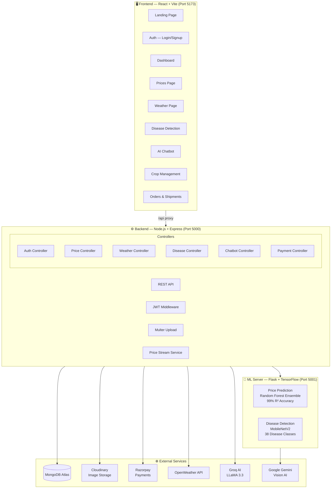

<div align="center">


<br/>

[](https://www.mongodb.com/)
[](https://expressjs.com/)
[](https://reactjs.org/)
[](https://nodejs.org/)
[](https://www.python.org/)
[](https://flask.palletsprojects.com/)
[](https://www.tensorflow.org/)
[](https://vitejs.dev/)

<br/>

[](https://github.com/jackstealer/AgriSmart/stargazers)
[](https://github.com/jackstealer/AgriSmart/network)
[](https://github.com/jackstealer/AgriSmart/issues)
[](https://opensource.org/licenses/MIT)

<br/>

> **AgriSmart** is a comprehensive full-stack agricultural management platform that bridges the gap between farmers and buyers through cutting-edge AI technology — combining ML-powered disease detection, real-time market price prediction, live weather intelligence, and an AI chatbot assistant.

[🚀 Quick Start](#-quick-start) • [✨ Features](#-features) • [🏗️ Architecture](#️-architecture) • [📡 API Docs](#-api-reference) • [🤝 Contributing](#-contributing)

</div>

---

## ✨ Features

<table>
<tr>
<td width="50%">

### 🦠 AI Disease Detection
Upload a photo of your crop and get instant disease diagnosis powered by **PlantVillage ML model** (38 disease classes) with Google Gemini Vision as a fallback. Receive treatment recommendations and prevention tips.

</td>
<td width="50%">

### 📈 ML Price Prediction
Real-time crop price predictions using an ensemble of **XGBoost + Random Forest + Gradient Boosting** models trained on AGMARK data. Achieves **99% R² accuracy** with trend analysis and seasonal insights.

</td>
</tr>
<tr>
<td width="50%">

### 🌦️ Smart Weather Intelligence
Live hyperlocal weather data via OpenWeather API with AI-generated farming advisories — irrigation recommendations, frost alerts, and harvest timing suggestions tailored to your crop.

</td>
<td width="50%">

### 🤖 AI Farming Chatbot
Conversational AI assistant powered by Groq (LLaMA 3.3) answering all your farming queries — crop selection, pest control, market timing, and agronomy best practices in multiple Indian languages.

</td>
</tr>
<tr>
<td width="50%">

### 🛒 Marketplace & Orders
Farmers can list produce, buyers can browse and place orders with full order lifecycle management — from creation to shipment tracking with real-time status updates.

</td>
<td width="50%">

### 💳 Razorpay Payments
Secure payment processing with Razorpay — supports order payments, refunds, and farmer payouts via Razorpay X. Full payment verification with webhook support.

</td>
</tr>
</table>

---

## 🏗️ Architecture



---

## 🗂️ Project Structure

```
AgriSmart/
├── 📁 agrismart-frontend/          # React + Vite frontend
│   ├── src/
│   │   ├── app/
│   │   │   ├── pages/              # All route pages
│   │   │   ├── components/         # Reusable UI components
│   │   │   ├── context/            # AuthContext
│   │   │   ├── layouts/            # DashboardLayout
│   │   │   └── services/           # API service layer
│   │   ├── i18n/                   # Multi-language support (EN/HI/PA/TA/TE/MR)
│   │   └── styles/                 # CSS + Tailwind config
│   ├── .env.example
│   └── vite.config.js              # Dev proxy → localhost:5000
│
├── 📁 backend/                     # Node.js + Express API
│   ├── src/
│   │   ├── controllers/            # Route handlers
│   │   ├── models/                 # Mongoose schemas
│   │   ├── routes/                 # Express routers
│   │   ├── services/               # Business logic
│   │   ├── middlewares/            # Auth + upload
│   │   ├── config/                 # DB, Cloudinary, Razorpay
│   │   └── utils/
│   └── app.js                      # Express entry point
│
├── 📁 ml-server/                   # Flask ML server
│   ├── app.py                      # Flask API + model loading
│   ├── train_price_model.py        # Train price prediction model
│   ├── price-data/                 # AGMARK crop price dataset
│   └── requirements.txt
│
├── .env.example                    # Environment variables template
├── docker-compose.yml              # Docker setup
└── render.yaml                     # Render.com deployment config
```

---

## 🚀 Quick Start

### Prerequisites

| Tool | Version |
|------|---------|
| Node.js | ≥ 18.x |
| Python | ≥ 3.9 |
| MongoDB | Atlas or Local |

### 1️⃣ Clone the Repository

```bash
git clone https://github.com/jackstealer/AgriSmart.git
cd AgriSmart
```

### 2️⃣ Set Up Environment Variables

```bash
# Backend
cp .env.example backend/.env
# Edit backend/.env with your API keys

# Frontend
cp agrismart-frontend/.env.example agrismart-frontend/.env
# Edit agrismart-frontend/.env
```

<details>
<summary>📋 <strong>Required API Keys (click to expand)</strong></summary>

<br/>

| Variable | Where to Get | Required |
|----------|-------------|----------|
| `MONGO_URI` | [MongoDB Atlas](https://cloud.mongodb.com) → Connect | ✅ Yes |
| `JWT_SECRET_KEY` | Any random string | ✅ Yes |
| `GROQ_API_KEY` | [console.groq.com](https://console.groq.com) — Free | ✅ Yes (chatbot) |
| `GEMINI_API_KEY` | [aistudio.google.com](https://aistudio.google.com) — Free | ⚠️ Optional (disease AI) |
| `OPENWEATHER_API_KEY` | [openweathermap.org](https://home.openweathermap.org/api_keys) — Free | ⚠️ Optional |
| `CLOUD_NAME/KEY/SECRET` | [cloudinary.com](https://cloudinary.com) — Free | ⚠️ Optional (profile images) |
| `RAZORPAY_KEY_ID/SECRET` | [razorpay.com](https://razorpay.com) — Test keys | ⚠️ Optional (payments) |

> **Note:** The app runs without optional APIs using smart fallbacks — simulated weather, auto-generated avatars, rule-based chatbot responses.

</details>

### 3️⃣ Install Dependencies

```bash
# Backend
cd backend && npm install

# Frontend
cd ../agrismart-frontend && npm install

# ML Server
cd ../ml-server && pip install -r requirements.txt
```

### 4️⃣ Train the ML Price Model

```bash
cd ml-server
python train_price_model.py
# ✅ Trains 3 ensemble models | ~99% R² accuracy | Saves to models/
```

### 5️⃣ Start All Services

Open **3 terminals** and run:

```bash
# Terminal 1 — ML Server (Flask)
cd ml-server
python app.py
# 🧠 Running on http://localhost:5001

# Terminal 2 — Backend (Node.js)
cd backend
node app.js
# ⚙️ Running on http://localhost:5000 | MongoDB Connected

# Terminal 3 — Frontend (Vite)
cd agrismart-frontend
npm run dev
# 🖥️ Running on http://localhost:5173
```

**Open [http://localhost:5173](http://localhost:5173) in your browser** 🎉

---

## 📡 API Reference

<details>
<summary>🔐 <strong>Authentication</strong></summary>

| Method | Endpoint | Description | Auth |
|--------|----------|-------------|------|
| `POST` | `/api/auth/signup` | Register new user (farmer/buyer) | No |
| `POST` | `/api/auth/login` | Login and get JWT token | No |

</details>

<details>
<summary>📈 <strong>Prices</strong></summary>

| Method | Endpoint | Description | Auth |
|--------|----------|-------------|------|
| `GET` | `/api/prices` | Get latest prices for all crops | No |
| `POST` | `/api/prices/predict` | ML price prediction | Yes |

**Predict payload:**
```json
{
  "crop": "Wheat",
  "state": "Punjab",
  "month": 5,
  "year": 2026,
  "rainfall_mm": 45,
  "temperature_c": 35
}
```

</details>

<details>
<summary>🌦️ <strong>Weather</strong></summary>

| Method | Endpoint | Description | Auth |
|--------|----------|-------------|------|
| `GET` | `/api/weather/current?lat=&lng=` | Live weather + AI advisory | Yes |

</details>

<details>
<summary>🦠 <strong>Disease Detection</strong></summary>

| Method | Endpoint | Description | Auth |
|--------|----------|-------------|------|
| `POST` | `/api/disease/detect` | Upload crop image for diagnosis | Yes |

**Request:** `multipart/form-data` with field `image`

</details>

<details>
<summary>🤖 <strong>Chatbot</strong></summary>

| Method | Endpoint | Description | Auth |
|--------|----------|-------------|------|
| `POST` | `/api/chatbot/message` | Send message to AI assistant | Yes |

</details>

<details>
<summary>🛒 <strong>Crops, Orders & Payments</strong></summary>

| Method | Endpoint | Description | Auth |
|--------|----------|-------------|------|
| `GET/POST` | `/api/crops` | List / create crops | Yes |
| `GET/POST` | `/api/orders` | List / create orders | Yes |
| `POST` | `/api/payment/create-order` | Create Razorpay order | Yes |
| `POST` | `/api/payment/verify` | Verify payment signature | Yes |
| `POST` | `/api/payment/refund` | Process refund | Yes |

</details>

---

## 🌍 Multi-Language Support

AgriSmart supports **6 Indian languages** on the signup/login screens:

| Language | Code | Script |
|----------|------|--------|
| English | `en` | Latin |
| हिंदी | `hi` | Devanagari |
| ਪੰਜਾਬੀ | `pa` | Gurmukhi |
| தமிழ் | `ta` | Tamil |
| తెలుగు | `te` | Telugu |
| मराठी | `mr` | Devanagari |

---

## 🐳 Docker Deployment

```bash
# Start all services with Docker Compose
docker-compose up --build

# Services:
# Frontend → http://localhost:5173
# Backend  → http://localhost:5000
# ML Server → http://localhost:5001
```

---

## 🔧 Tech Stack

<table>
<tr>
<th>Layer</th>
<th>Technology</th>
<th>Purpose</th>
</tr>
<tr>
<td><strong>Frontend</strong></td>
<td>React 18, Vite, Tailwind CSS, shadcn/ui, Recharts, Framer Motion</td>
<td>UI, routing, data visualization, animations</td>
</tr>
<tr>
<td><strong>Backend</strong></td>
<td>Node.js, Express.js, Mongoose, Multer, dotenvx</td>
<td>REST API, auth, file uploads</td>
</tr>
<tr>
<td><strong>Database</strong></td>
<td>MongoDB Atlas</td>
<td>User data, crops, orders, prices, shipments</td>
</tr>
<tr>
<td><strong>ML Server</strong></td>
<td>Python, Flask, TensorFlow 2.x, scikit-learn, XGBoost, pandas</td>
<td>Price prediction, disease detection</td>
</tr>
<tr>
<td><strong>AI APIs</strong></td>
<td>Groq (LLaMA 3.3), Google Gemini Vision</td>
<td>Chatbot, disease AI analysis</td>
</tr>
<tr>
<td><strong>External</strong></td>
<td>Cloudinary, Razorpay, OpenWeather</td>
<td>Media storage, payments, weather</td>
</tr>
<tr>
<td><strong>Auth</strong></td>
<td>JWT + bcrypt</td>
<td>Stateless authentication</td>
</tr>
</table>

---

## 🤝 Contributing

Contributions are welcome! Here's how to get started:

```bash
# 1. Fork the repo and create your branch
git checkout -b feature/amazing-feature

# 2. Make your changes and commit
git commit -m "feat: add amazing feature"

# 3. Push and open a Pull Request
git push origin feature/amazing-feature
```

**Please follow:**
- [Conventional Commits](https://www.conventionalcommits.org/) for commit messages
- ESLint rules (run `npm run lint` before committing)
- Add tests for new backend routes

---

## 📄 License

This project is licensed under the **MIT License** — see the [LICENSE](LICENSE) file for details.

---

## 👨‍💻 Author

<div align="center">

**Atul Raj**

[](https://github.com/jackstealer)

<br/>

*Built with ❤️ for Indian farmers*

<br/>

⭐ **Star this repo if you find it useful!** ⭐

</div>
